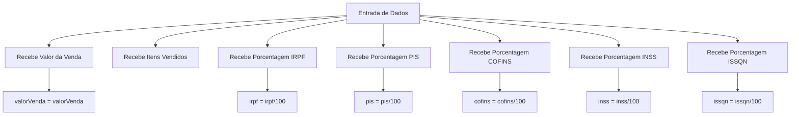
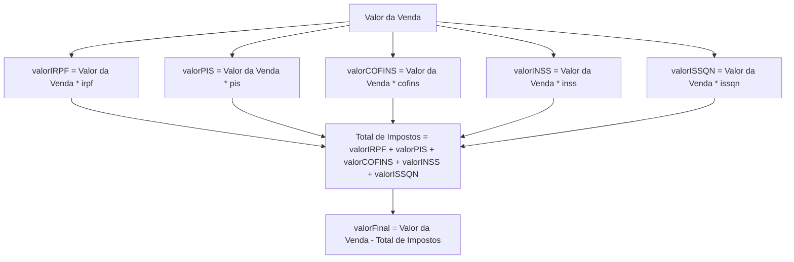

# Nota Fiscal de Serviço (NFS-e)

Este projeto é uma aplicação em HTML e JavaScript para geração de uma Nota Fiscal de Serviço (NFS-e), que lê os dados fornecidos pelo usuário, realiza os cálculos dos impostos aplicáveis e exibe a Nota Fiscal final com todas as informações e impostos calculados.

## Funcionalidades

- Leitura de dados de entrada:
  - Valor da venda
  - Itens vendidos
  - Porcentagens dos impostos: IRPF, PIS, COFINS, INSS, ISSQN
- Cálculo dos impostos com base nos dados fornecidos
- Exibição da Nota Fiscal detalhada com os valores e cálculos dos impostos
- Impressão da Nota Fiscal: Possibilidade de imprimir a Nota Fiscal gerada.

## Diagrama 1: Obtendo os Valores Inseridos pelo Usuário


## Diagrama 2: Cálculo dos Impostos



## Tecnologias Utilizadas

HTML: Para estruturar a página e os campos de entrada. <br/>
<br/>
CSS: Para estilização simples da interface. <br/>
<br/>
JavaScript: Para realizar os cálculos dos impostos e exibir a Nota Fiscal. <br/>
<br/>
Mermaid.js: Para criar o diagrama de fluxo dos cálculos.

##  Como Usar
1. Clone o repositório:
   ```bash
   git clone https://github.com/jonatasdamata/EmissaoDeNFS
2. Abra o arquivo index.html em seu navegador. <br>
3. Preencha os campos com os valores de venda, itens vendidos e as porcentagens dos impostos. <br>
4. Clique no botão "Gerar Nota Fiscal" para ver os cálculos e o resultado. <br>
5. Clique no botão "Imprimir Nota Fiscal" para imprimir a nota gerada.

## Licença
Este projeto está licenciado sob a licença MIT 📚. <br>
Veja o arquivo de licença para mais detalhes.

[LICENSE](https://github.com/jonatasdamata/EmissaoDeNFS/blob/main/LICENSE)

## Agradecimentos
Agradeço à Vanessa Arseli pela oportunidade de participar do processo seletivo para estágio em Desenvolvimento de Software na Saguitech. Estou empolgado com a possibilidade de fazer parte da equipe e contribuir com meu conhecimento.

